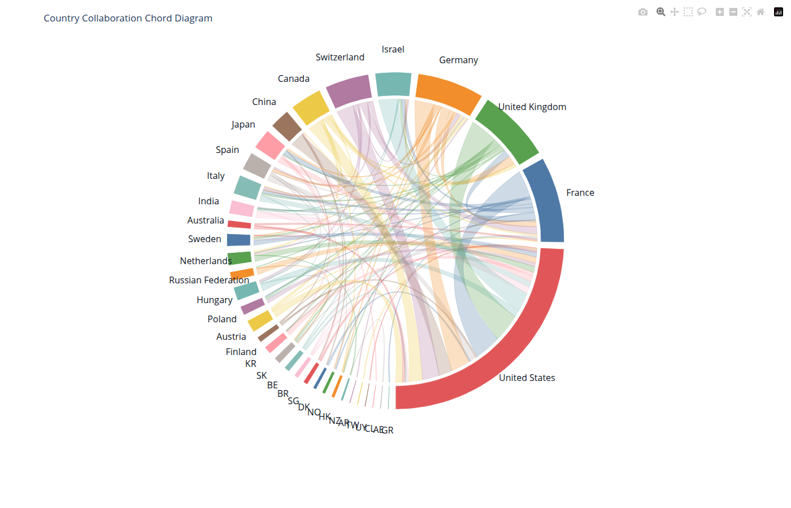
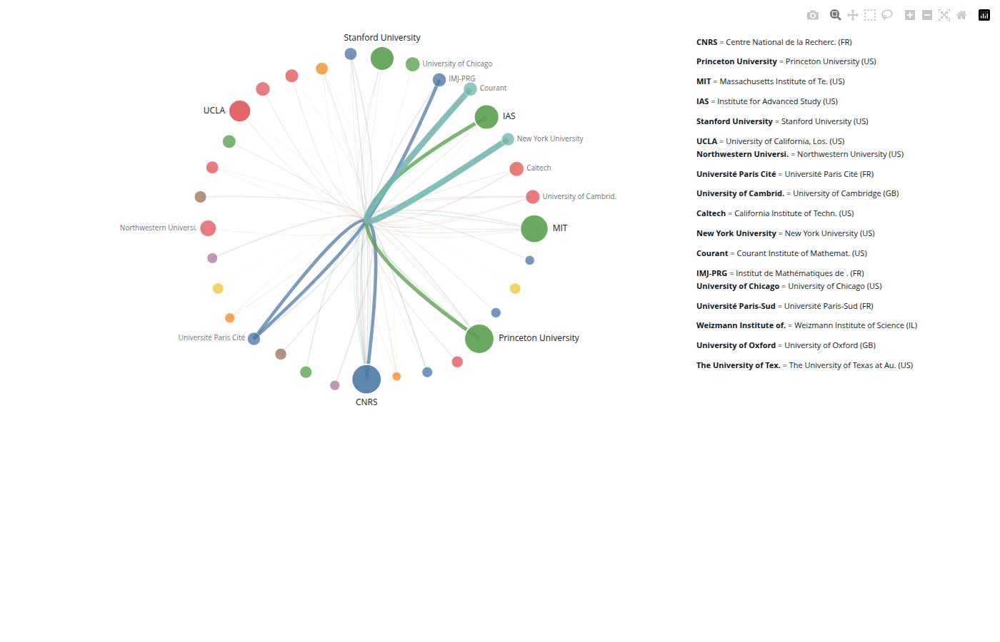
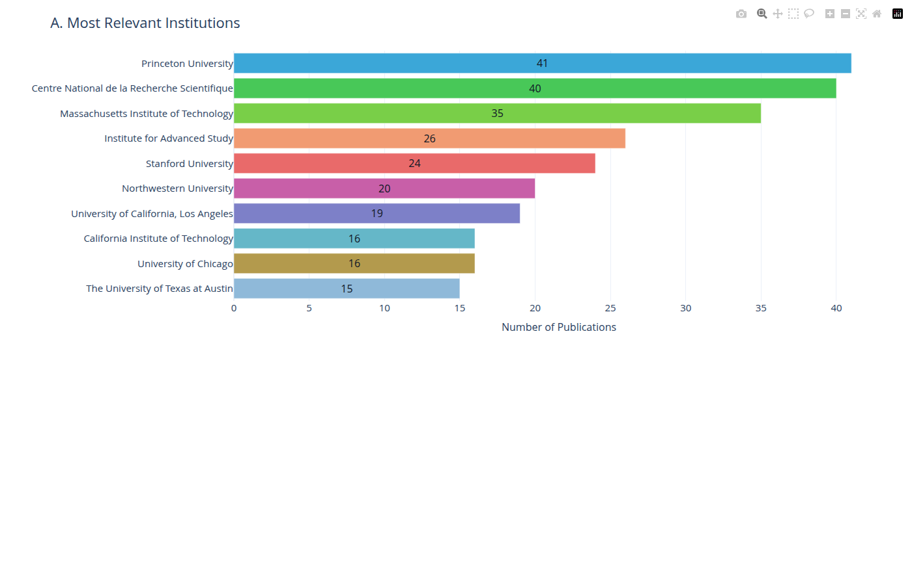
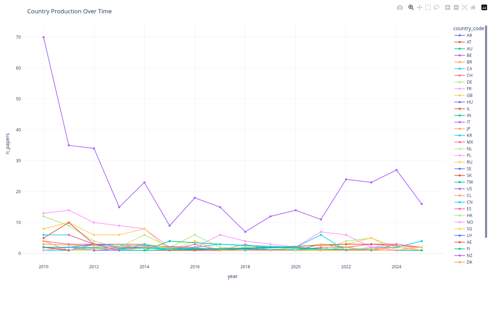
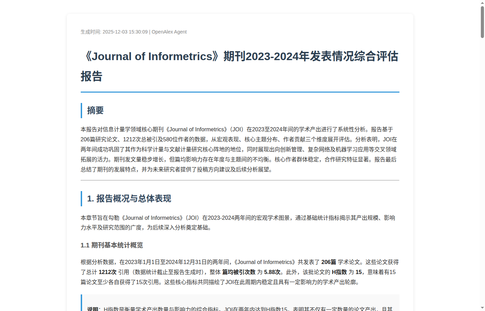

# 🔬 MetaScientist

**MetaScientist** 是一个面向 AI 科学家的 **综合性学术发现平台**——从数据获取、领域分析到假设生成，提供完整的科学研究基础设施。

它把十几个分散的学术数据源整合为统一的 agent-native 接口，让 AI agent 能够像经验丰富的研究员一样工作：自动检索文献、分析领域格局、追踪研究动态，直到输出结构化的洞察与报告。**整条链路已经跑通，并持续向更深度的科学发现演进。**

---

## 🗂️ 项目结构

```
metascientist/
├── metasci-universe/     # 🌌 核心 Python 包（CLI + Python API 双入口）
│   ├── providers/        #    数据源适配层（OpenAlex、DBLP、OpenReview、WoS、Scopus…）
│   ├── analysis/         #    分析引擎（文献计量、宏观格局、作者全景、主题地图、引用结构…）
│   ├── workflows/        #    一键式组合工作流（science_landscape 等）
│   └── cli.py            #    metasci 命令行
│
├── metasci-skills/       # 🛠️ 跨平台 Skills（Claude Code / Codex CLI 均可直接加载）
│   ├── metasci-data-fetch      #  数据检索与实体消歧
│   ├── metasci-citation-lookup #  单篇论文引用 / 被引追踪
│   ├── metasci-analysis        #  分析、建模、可视化
│   └── metasci-report-writer   #  结构化报告撰写
│
├── metasci-agent/        # 🤖 轻量 Agent 层（工具封装为 agent-callable 接口）
├── metasci-provider/     # ☁️  私有数据服务骨架（付费源接入、云端化扩展）
└── MetaDataGet/          # 📄 学者主页采集 + WoS/Scopus 元数据接入
```

---

## 🎯 三种使用层次

根据你的需求，可以在三个层次上使用 MetaScientist：

```
┌─────────────────────────────────────────────────────────────────┐
│  🤖  Agent 层    独立 agent，自主规划与执行研究任务，无需外部框架    │
├─────────────────────────────────────────────────────────────────┤
│  🛠️  Skill 层    加载 skill 后，一句自然语言驱动完整研究流水线      │
├─────────────────────────────────────────────────────────────────┤
│  📦  Package 层  几行 Python 或一条 CLI 命令，直接调用任意能力      │
└─────────────────────────────────────────────────────────────────┘
```

**📦 Package 层** — 直接使用 `metasci-universe`，几行代码或一条 CLI 命令即可完成数据检索、领域分析、可视化输出，灵活组合各分析模块。

**🛠️ Skill 层** — 将 skills 加载到 Claude Code 或 Codex CLI 后，用一句自然语言触发完整的数据→分析→报告流水线，无需了解底层实现。

**🤖 Agent 层** — `metasci-agent` 作为独立自主 agent 运行，不依赖外部 agent 框架，自主规划检索策略、调用分析工具、输出研究报告。

---

## 🧩 三个核心组件

### 🌌 metasci-universe — Agent-Native 核心工具包

项目的数据与分析引擎，以 Python 包形式交付，支持 CLI 与 Python API。

**数据获取层** 统一接入 7 大类学术数据源：OpenAlex（2 亿+ 论文）、DBLP、OpenReview、ACL Anthology、CVF / IEEE / PMLR，以及付费数据库 Web of Science 和 Scopus，覆盖 **20+ 顶会**直接拉取。

**分析引擎** 包含多个可独立调用、也可组合运行的分析模块：
- 📊 **bibliometrics** — 发文趋势、引用分布、来源分布
- 🗺️ **macro** — 国家生产力地图、机构排名、国际合作弦图、时序演化
- 👥 **author_landscape** — 作者角色分析、合作网络、机构关联
- 🔤 **topic_landscape** — 关键词共现网络、主题建模、术语演化
- 📑 **citation_overview** — 高影响论文排名、参考文献频率
- 🔭 **science_landscape** — 以上模块的一键组合工作流

### 🛠️ metasci-skills — 多层次跨平台 Skills

四条经过充分调试的 skill，覆盖从数据到报告的完整链路，可在 Claude Code、Codex CLI 等任意支持 skill 的平台直接加载使用：

**`metasci-data-fetch`** 🔍 数据检索与实体消歧
- 按关键词、主题、机构、年份等多维度检索论文
- 直接拉取 NeurIPS / ICLR / ACL 等 20+ 顶会全量收录
- 作者消歧与主页检索，支持 7 个来源交叉验证
- 智能判断查询策略（keyword vs topic），推荐最优检索方式

**`metasci-citation-lookup`** 🔗 单篇论文引用追踪
- 根据 title / DOI / arXiv ID / OpenAlex ID / S2 ID 解析论文身份
- 单独查询参考文献 `refs` 或被引论文 `citing`，避免不必要的 API 调用
- 默认 OpenAlex 优先；当引用边缺失或明显不完整时，用 Semantic Scholar 补充
- `lookup` 一次返回 references 与 citing papers，并在需要补充时协调两边结果

**`metasci-analysis`** 📊 分析、建模与可视化
- 自动判断数据集的分析适配性（preflight 预检），给出安全默认参数
- 按需运行任意分析模块，或一键触发完整 science_landscape 工作流
- 输出 HTML 交互图表、CSV 数据表、Markdown 摘要及可复现溯源文件

**`metasci-report-writer`** ✍️ 结构化报告撰写
- 读取分析产出的 artifacts，生成叙事连贯的领域全景报告
- 覆盖趋势判断、机构解读、主题聚类、引用结构等核心叙事维度
- 支持从粗稿到精稿的迭代改写，对标文献计量顶刊的图文规范

加载 skills 后，一句话即可驱动完整流水线：

```
"给我分析 ICLR 2024 强化学习方向的论文，输出完整的领域全景报告"
  → metasci-data-fetch    检索 · 消歧 · 采集
  → metasci-analysis      分析 · 建模 · 可视化
  → metasci-report-writer 撰写 · 排版 · 输出
  → 结构化领域报告 ✅
```

### 🤖 metasci-agent — 独立 Agent 层

将 universe 的全部数据与分析能力封装为 agent-callable 接口，作为**不依赖外部 agent 框架**的独立自主研究 agent 运行。给定一个研究问题，自主规划检索策略、调用分析工具、组织输出。后续将集成到自研平台 **widi-mono**（开发中）。

---

## ⚡ 能力展示

### 一、广泛的数据获取

```
                        📡 MetaScientist 数据源
                               │
          ┌────────────────────┼────────────────────┐
          │                    │                    │
    🌐 开放数据源          📚 顶会直连           💼 付费数据库
          │                    │                    │
   OpenAlex 🔵          OpenReview 🟠        Web of Science 🟡
   DBLP 🟢             ACL Anthology 🔴      Scopus 🟣
                        CVF Open Access 🔵
                        PMLR 🟤
```

**数据源覆盖一览：**

| 数据源 | 覆盖内容 | 规模 | 可获取的字段 |
|--------|---------|------|-------------|
| 🔵 OpenAlex | 全学科论文、作者、机构 | 2 亿+ 论文 | 标题、摘要、引用、作者、机构、主题、DOI |
| 🟢 DBLP | CS 全领域会议与期刊 | 完整 CS 档案 | 标题、作者、年份、venue |
| 🟠 OpenReview | ML 顶会投稿与录用 | NeurIPS / ICLR / ICML | 论文、评审、录用状态 |
| 🔴 ACL Anthology | NLP 顶会完整 proceedings | ACL / EMNLP / NAACL / COLING / EACL | 标题、作者、PDF 链接 |
| 🔵 CVF Open Access | 计算机视觉顶会 | CVPR / ICCV / WACV | 标题、作者、PDF |
| 🟤 PMLR | 统计与 ML 会议 | AISTATS / COLT / CoRL / UAI | 标题、作者、PDF |
| 🟡 Web of Science | 全学科高质量期刊（付费）| 全学科 | 标题、摘要、引用、机构、关键词 |
| 🟣 Scopus | 全学科高质量期刊（付费）| 全学科 | 标题、摘要、引用、机构、关键词 |

**支持直接拉取的顶会（20+）：**
`NeurIPS` `ICML` `ICLR` `ACL` `EMNLP` `NAACL` `COLING` `CVPR` `ICCV` `WACV` `ECCV` `AAAI` `IJCAI` `KDD` `WWW` `SIGIR` `CHI` `AISTATS` `CoRL` `UAI` `COLT` ···

---

**📦 Package 层 — CLI**

```bash
# 按关键词检索论文，保存到本地
metasci works search --query "graph neural networks" --from-year 2022 --limit 300 \
  --include authors --save metasci_outputs/gnn_2022.json --json

# 拉取 ICLR 2024 全量录用论文
metasci conferences papers --venue "iclr" --year 2024 --json

# 检索某机构发表的论文
metasci works search --institution-name "Peking University" --from-year 2023 --json

# 查找学者并获取主页
metasci authors search --name "Yoshua Bengio" --limit 5 --json
```

**📦 Package 层 — Python API**

```python
import metasci_universe as ms

# 按主题检索论文（适合概念性宽泛查询）
result = await ms.run_tool("works.search", {
    "topic_name": "large language models", "from_year": 2024, "limit": 500
})

# 拉取顶会录用列表
result = await ms.run_tool("conferences.papers", {"venue": "neurips", "year": 2024})

# 获取某作者的全部论文
result = await ms.run_tool("works.search", {"author_id": "A5023888391", "limit": 200})
```

**🛠️ Skill 层 — 自然语言驱动**

```
"帮我获取 ACL 2023 和 EMNLP 2023 的全部论文，分别保存"

"检索近三年量子计算领域的论文，需要包含作者和机构信息"

"找到 Geoffrey Hinton 的所有论文，以及他的个人主页"

"测试 CycleResearcher 这篇论文的引用关系"

"拉取数学四大期刊 2010-2025 的全量文章"
```

**学者主页采集** 支持 7 个来源交叉验证，每条记录含置信度评分：

```json
{
  "scholar_name": "Fei-Fei Li",
  "affiliation": "Stanford University",
  "homepage_url": "https://profiles.stanford.edu/fei-fei-li",
  "source": "csrankings",
  "confidence": 0.97
}
```

---

### 二、分析、计算与可视化

获取数据之后，一行代码启动完整领域分析：

```python
import metasci_universe as ms

result = await ms.workflows.science_landscape(
    "metasci_outputs/works_diffusion_2023.json",
    output_dir="outputs/diffusion_landscape/"
)
```

这一行自动完成：

- **文献计量** — 发文趋势、引用模式、来源分布
- **宏观格局** — 国家生产力地图、国际合作弦图、机构时序演化
- **作者全景** — 主要贡献者、合作网络、机构关联
- **主题地图** — 关键词共现网络、主题建模、术语演化
- **引用结构** — 高影响论文排名、参考文献频率

输出包含 Markdown 报告、HTML 交互图表、CSV 数据表，以及可复现的溯源文件。

**实际案例 — 数学四大期刊分析（2010-2025，Annals of Mathematics）：**

| 国家合作弦图 | 机构合作网络 |
|:-----------:|:-----------:|
|  |  |

| 机构发文排名 | 国家发文时序 |
|:-----------:|:-----------:|
|  |  |

**实际案例 — Nature Communications LLM 论文全景分析（2025-2026）：**

完整报告会生成到本地 `metasci_outputs/analysis/nature_communications_llm_2025_2026_science_landscape/`。

---

### 三、结构化报告撰写

分析产出直接转化为可发布的科学全景报告，覆盖发文趋势、核心贡献者、高影响力论文、主题聚类与演化趋势等叙事维度。

**实际报告示例 — 《Journal of Informetrics》2023-2024 年发表情况分析：**

> 提问：*"请帮我分析 Journal of Informetrics 期刊 2023、2024 年的发表情况"*



报告摘要节选：

> 本报告对《Journal of Informetrics》（JOI）在 2023 至 2024 年间的学术产出进行了系统性分析。报告基于 **206 篇**研究论文、**1212 次**总被引及 **580 位**作者的数据，从宏观表现、核心主题分布、作者贡献三个维度展开评估。分析表明，JOI 成功巩固了其作为科学计量与文献计量研究核心阵地的地位，同时展现出向创新管理、复杂网络及机器学习应用等交叉领域拓展的活力……

报告自动生成的核心内容包括：

| 维度 | 内容 |
|------|------|
| 📊 总体表现 | 年度发文量对比、引用分布、H 指数、篇均被引趋势 |
| 🔤 主题分析 | 核心主题频率排名、高影响力新兴主题、主题演化热点 |
| 👥 作者贡献 | 高产作者排名、生产力与影响力对比、合作网络特征 |
| 📄 高影响论文 | Top 被引论文列表、主题聚焦解读、研究模式归因 |
| 🔭 趋势研判 | 方法论演进方向、问题导向特征、对研究者的投稿建议 |

---

## 快速上手

```bash
# 1. 安装核心包
pip install metasci-universe

# 如果需要运行下面的 science_landscape 分析工作流，安装分析能力
pip install "metasci-universe[analysis]"

# 本仓库开发模式可用：
# cd metasci-universe && pip install -e ".[analysis]"

# 2. 加载 skills（Claude Code）
cp -r metasci-skills/skills/* ~/.claude/skills/

# 3. 检索数据
metasci works search --query "large language models" --from-year 2024 --limit 200 \
  --save metasci_outputs/llm_2024.json --json

# 4. 运行分析
python - <<'EOF'
import asyncio, metasci_universe as ms
async def main():
    result = await ms.workflows.science_landscape(
        "metasci_outputs/llm_2024.json",
        output_dir="outputs/llm_landscape/"
    )
    print(result.summary())
asyncio.run(main())
EOF

# 5. 在 Claude Code 中用自然语言驱动全流水线
# 直接对话："/metasci-data-fetch 获取 ACL 2024 论文，然后生成全景报告"
```

安装层级：

| 安装命令 | 适用场景 |
|----------|----------|
| `pip install metasci-universe` | 只做数据获取、作者/论文/会议/引用查询 |
| `pip install "metasci-universe[analysis]"` | 常规文献计量、宏观、作者、主题、引用分析 |
| `pip install "metasci-universe[embeddings]"` | 需要本地 sentence-transformers 向量与语义聚类 |
| `pip install "metasci-universe[all]"` | 全功能，包括 BERTopic、HDBSCAN、spaCy 等重后端 |

默认分析配置使用轻量的 sklearn 分词与 LDA；只有显式选择 embedding 或 BERTopic 后端时，才需要安装更重的 extras。

---

## 🗺️ Roadmap

### 🔨 近期
- 🌐 **验证并扩展数据源覆盖** — 持续验证现有数据质量，补充 arXiv、PubMed 等开放源及中文学术数据库
- ✍️ **完善报告写作 skill** — 对标顶刊文献计量论文的图文规范，提升生成报告的叙事深度与可读性
- 🧠 **加入记忆管理** — 跨会话持久化研究上下文，让 agent 在多次对话中保持连贯的研究状态
- 📣 **产出可传播的分析内容** — 利用平台能力开展有趣的科学学分析（顶刊作者图谱、学科崛起趋势等），输出可公开传播的内容

### 🚀 中期
- 🔄 **论文自动追踪与知识图谱更新** — 持续监听指定领域新论文，自动更新知识结构，让研究者始终掌握最新动态
- 🔭 **Auto-Discovery 前哨** — 在海量文献中自动识别热点、新兴方向与研究空白，为假设生成提供数据驱动的输入
- 🔬 **更深度的科学学研究** — 在宏观格局分析之上，挖掘学科演化规律、知识流动路径、合作模式变迁等深层结构
- 🔁 **能力双向流动** — 在实用系统中沉淀出的分析模式与工具，反向补充到核心框架，让平台随使用不断增强

### 🌟 长期
- 🏗️ **综合产品化** — 在框架基础上开发面向科研机构、情报部门的完整产品，实现可持续的商业价值
- 📚 **训练语料沉淀** — 平台采集的结构化学术数据与 agent 研究轨迹，可作为科学领域模型的高质量训练语料
- 🤖 **AI-Scientist 综合发现平台** — 最终形态：一个 AI 科学家不可或缺的基础设施，覆盖从文献发现、假设生成到实验设计的完整研究闭环，用户可在此基础上自由扩展

---

## 💡 商业化愿景

MetaScientist 的起点是**整合**与**重构**——把十几个分散的学术数据源统一成一个 agent-native 接口，这本身已有清晰的商业价值。但更大的想象空间在于它所指向的方向：

> **一个 AI 科学家赖以工作的综合性发现平台。**

近期价值体现在工具层：数据检索、领域分析、报告生成，直接节省研究者数天的调研时间。中期价值体现在系统层：自动追踪、知识图谱、趋势发现，成为科研团队持续运转的情报中枢。长期价值体现在数据层：沉淀的结构化学术数据与 agent 轨迹，是训练下一代科学 AI 模型的高质量语料。

| 用户群体 | 核心价值 | 产品方向 |
|---------|---------|---------|
| 独立研究者 / 博士生 | 快速建立领域认知，节省调研时间 | 报告生成 SaaS |
| 科研团队 / 实验室 | 持续追踪领域动态，管理研究知识库 | 订阅制知识平台 |
| 高校 / 科研机构 | 学科评估、学者画像、机构合作分析 | 订阅 API |
| 科技情报 / 智库 | 技术趋势监测、竞争态势分析 | 定制化分析服务 |
| AI 研究团队 | 高质量学术语料与科学知识图谱 | 数据 API + SDK |

---

## 可扩展性

每个扩展点都有清晰接口和现有实现可参照：

- **新数据源** — 实现 `BaseProvider`，现有 7+ 实现作为参考
- **新分析模块** — 注册到 analysis API 即可进入 workflow 体系
- **新 Skill** — 遵循 `SKILL.md` 模板，任何 Claude/Codex 实例立即可用
- **云端化** — metasci-provider 已是服务化骨架，可直接演进为云 API 层

---

## 参与进来

MetaScientist 还在快速发展中。欢迎参与：

- 接入新数据源（arXiv、PubMed、IEEE Xplore、中文数据库）
- 开发新分析模块（专利分析、资助信息、引用网络）
- 构建平台之上的应用（期刊推荐、综述生成、会议分析）
- 完善 skills 的覆盖范围和鲁棒性
- 云端化与 API 服务化

> 学术数据的 agent-native 接入，是未来一切科学 AI 应用的前提。
> 这是一个值得长期投入的基础设施项目。
